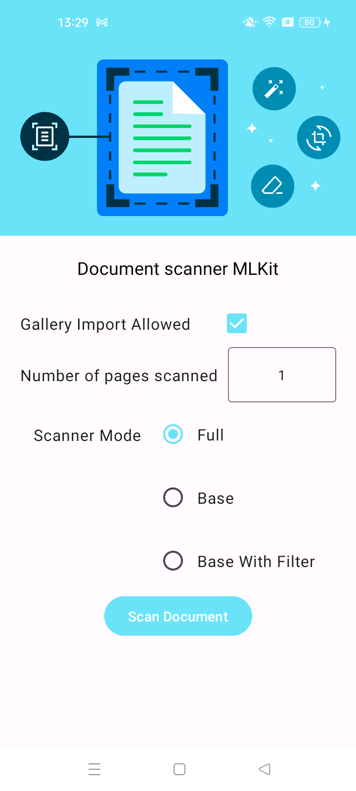
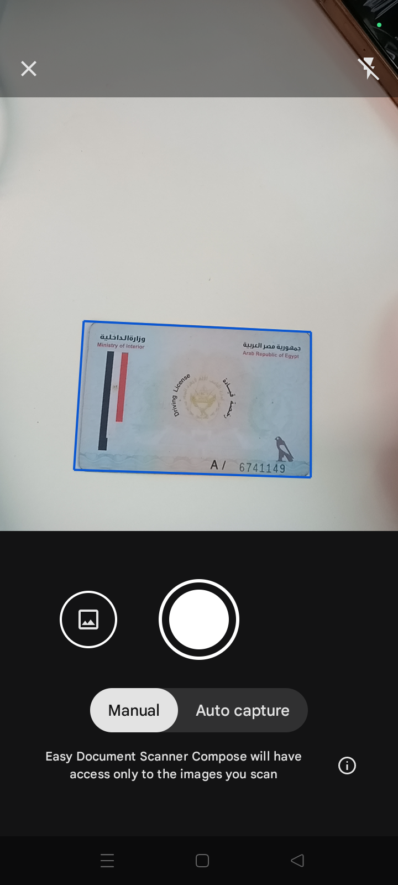

# Easy Document Scanner
Anroid Compose App example for Document Scanner MLKit

Digitizing physical documents, which allows users to convert physical documents into digital formats has become a very common user journey in mobile apps. ML Kit's document scanner API provides a comprehensive solution with a high-quality, consistent UI flow across Android apps and devices. Once the document scanner flow is triggered from your app, users retain full control over the scanning process. They can optionally crop the scanned documents, apply filters, remove shadows or stains, and easily send the digitized files back to your app.

The UI flow, ML models and other large resources are delivered using Google Play services, which means:
    -Low binary size impact (all ML models and large resources are downloaded centrally in Google Play services).
    -No camera permission is required - the document scanner leverages the Google Play services' camera permission, and users are in control of which files to share back with your app.
The entire document scanner flow operates on-device.

Setup Scanner Config                                              |  Document Scanner            
:-------------------------------------------------------: |:-------------------------:
  |   

[more information](https[://www.example.com](https://developers.google.com/ml-kit/vision/doc-scanner)https://developers.google.com/ml-kit/vision/doc-scanner)

